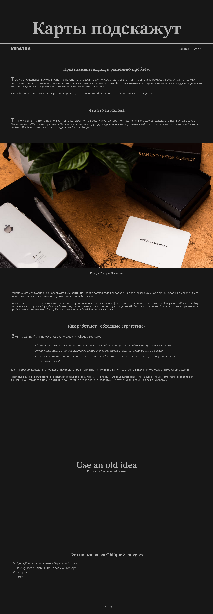
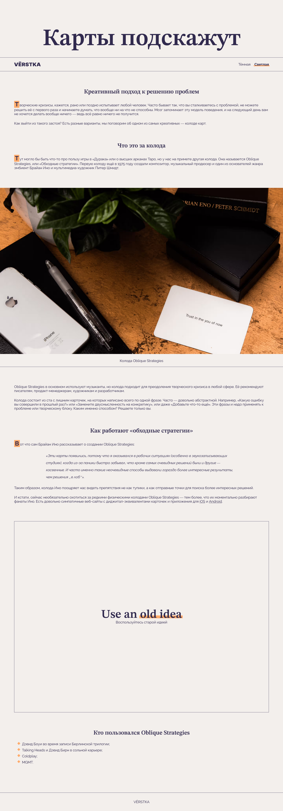

# Яндекс Практикум, готовый кейс "Карты подскажут"

## Оглавление

- [Ссылки](#ссылки)
- [Скриншоты](#скриншоты)
- [Описание](#описание)
- [Автор](#автор)
- [Благодарность](#благодарность)

### Ссылки

- Live версия сайта: [Netlify](https://poetic-meringue-f2337f.netlify.app/)

### Скриншоты

### Описание

Готовый кейс с "резиновой версктой" и переключением между тёмной и светлой темой.

## Автор

- Github - [Mike Beloborodov](https://github.com/MikeBeloborodov)
- Frontend Mentor - [@MikeBeloborodov](https://www.frontendmentor.io/profile/MikeBeloborodov)

## Благодарность

Благодарю команду Яндекс Практикум за предоставление дизайна и уроков!